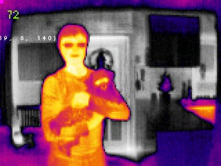
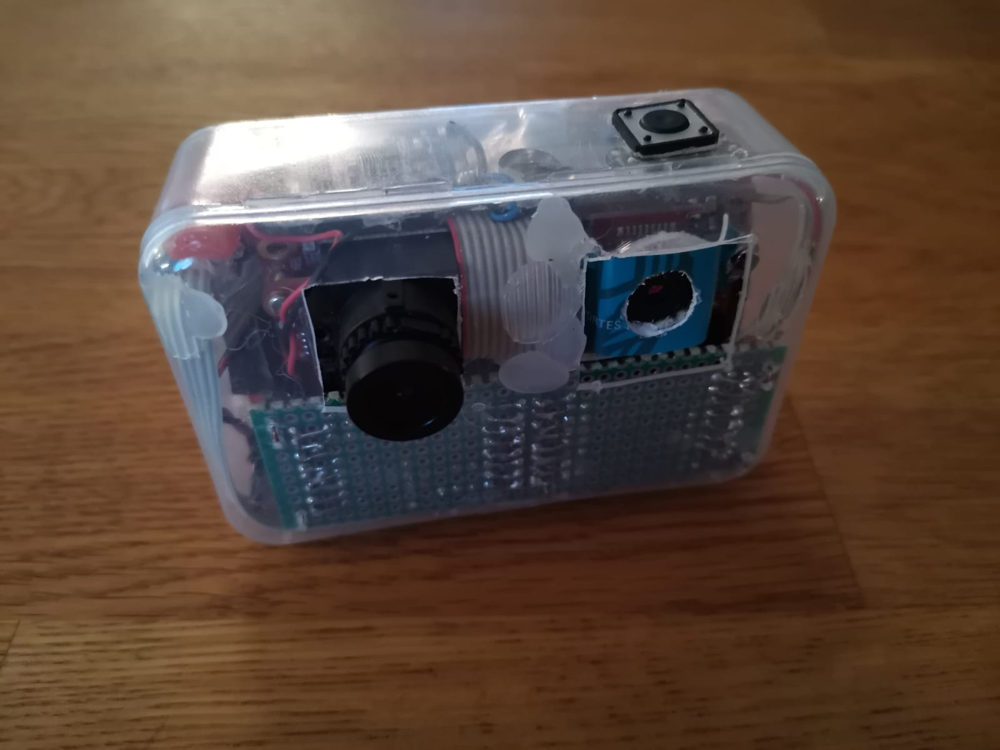
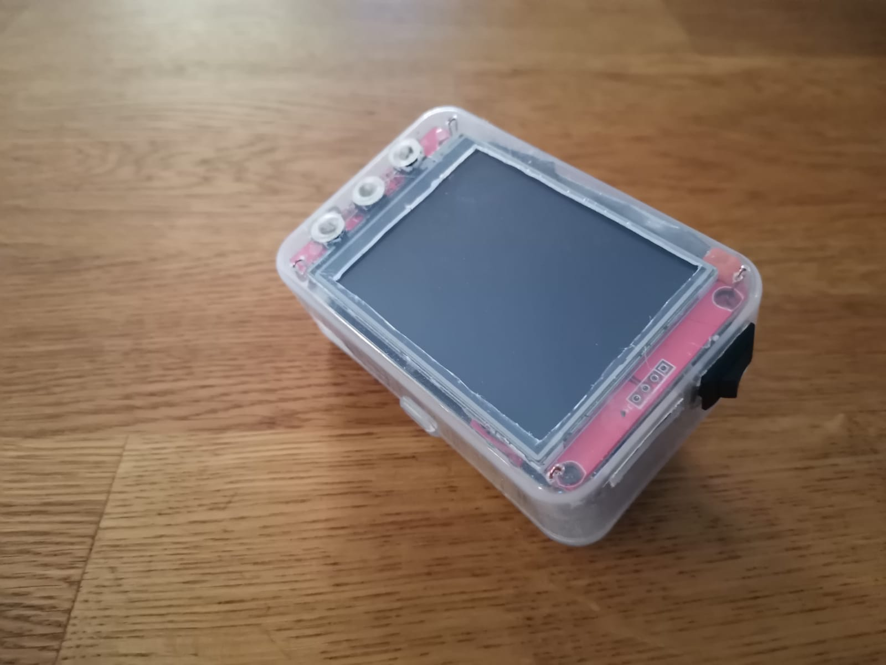
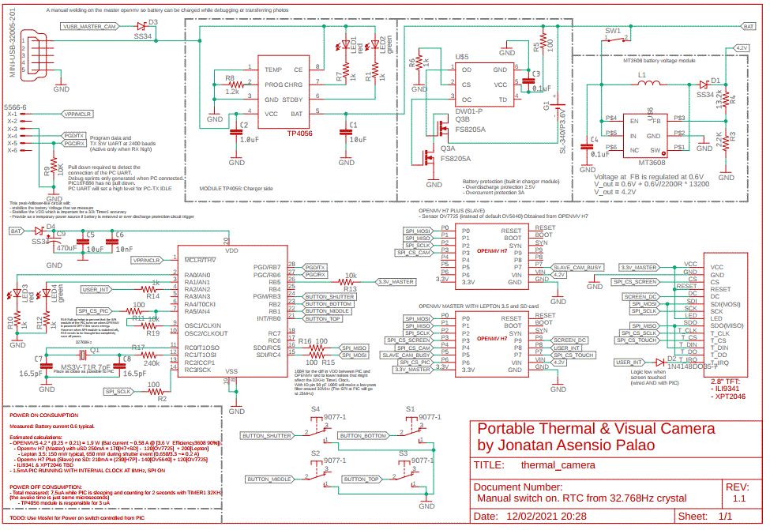
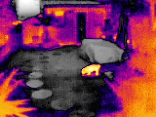
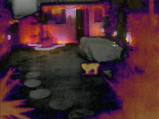
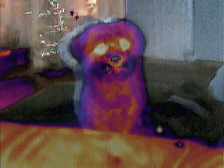

A portable thermal camera with visual image fusion   

### Table of Contents  

- [Introduction](#introduction)
- [Electronics](#electronics)
- [Software](#software)
- [Results](#results)  
- [Hardware mounting](#hardware_mounting)  
- [References](#references)
- [Contact](#contact) 

#### Design records:
* [Initial](doc/design_record_001_initial.md)
* [Real Time Clock Improvement](doc/design_record_002_rtc_improvement.md)

<a name="introduction"/>

## Introduction

This project details the software and hardware to build a portable camera which is capable of combining the images from a thermal camera and a normal camera. Project features:

- Multiple Image modes: Thermal Rainbow palette, Thermal Gray scale, Visual and Thermal image mix, etc.
- 2.8" Touch screen (ILI9341 and XPT2046). Temperature pointer at the touched location.
- Low power Off design. Power off with Real Time Clock (RTC) consumption as low as 7.5 uA.
- Navigation and shutter buttons.
- Battery voltage measurement
- Open source hardware and free tooling through out all the project.
   - Openmv H7 with Lepton 3.5 Thermal Camera (SPI master) and SD card.
   - Secondary Openmv H7 Plus with OV7725 sensor for Visual image (SPI slave).
   - Auxiliary controller with PIC16F886 (RTC, Buttons, Battery check)

<a name="electronics"/>

## Electronics

See: [Design decisions involved in version 1](doc/design_record_001_initial.md)

### Design records:
* [Initial](doc/design_record_001_initial.md)
* [Real Time Clock Improvement](doc/design_record_002_rtc_improvement.md)

<a name="software"/>

## Software

Main features:

* Save photos in bmp format
* Choose a preview mode:
   1. Thermal mode with Non-linear color
   2. Same as mode-1 with temperature blobs detection
   3. Thermal mode with Linear Grey (ideal for: Night vision. Playback analysys of pictures)
   4. Visual image. Image from the Openmv with visual camera
   5. Mix image. Interlaced images from mode-1 and mode-4
* Thermal options:
   * Manual trigger of the Flat Field Correction
   * Change Emissivity
   * Choose Gain mode
   * Set a static or dynamic temperature range:
      * Both methods will use radiometric measurements and deliver absolute temperature.
      * Static will saturate the image color at the desired minimum/maximum. Useful for identifying a specific temperature
      * Dynamic will adjust minimum and maximum of the image scene and get best overall contrast.
      * The chosen mode can be saved for next usages.
   * Touch the screen to get the temperature in a specific point
      * Setting to enable/disable cursor in full screen mode   
* Playback photos
   * Navigate up and down through saved photos
   * Analysis of pixel temperatures (Valid for grey-scale thermal images)
   * Delete photos
* Utility features:
   * Set time and date
   * Save and restore settings
   * Calibrate touch coordinates
   * Calibrate Field of view of the visual image, to perfectly match the Thermal image for preview mode-5

For further indications on how to use and understand the software:
- [Software description](doc/software_description.md)
- [Software deployment](doc/software_deployment.md)

<a name="hardware_mounting"/>

## Hardware mounting

For Lepton 3.5 mounting, see: [Mounting Lepton](doc/lepton_mounting.md)

<a name="results"/>

## Results

<a name="references"/>

## References

Openmv links:
* General info: https://openmv.io/
* Framework repo: https://github.com/openmv/openmv
* Micropython repo: https://github.com/micropython/micropython

Several datasheets or manufacturer documents have been cached in this project so future readers have the copy of the document that was used during the design of this project:

[Reference values for ILI9341 in Application notes](doc/external/ILI9341.pdf)
[Datasheet PIC16F866 (including AC/DC characteristics) ](doc/external/ILI9341.pdf)
[Lepton 3.5 Engineering datasheet](doc/external/Lepton_3_5_Eng.pdf)
[Lepton 3.5 API](doc/external/Lepton_3_5_API.pdf)

Reference repos while I was getting started with the touch display:
 * To display on ILI9341: https://github.com/OutOfTheBots/OpenMV_TFT
 * To read touch from XPT2046: https://github.com/Luca8991/XPT2046-Python

[Linked in Jonatan Asensio Palao](https://es.linkedin.com/in/jonatan-asensio-palao-369a4143)

_____

Tags: camara termica, lepton, openmv h7, pic16f886, boostc, eagle, crystal 32k, rtc, real time clock, ili 9341, xpt 2046, mt3608, tp4056