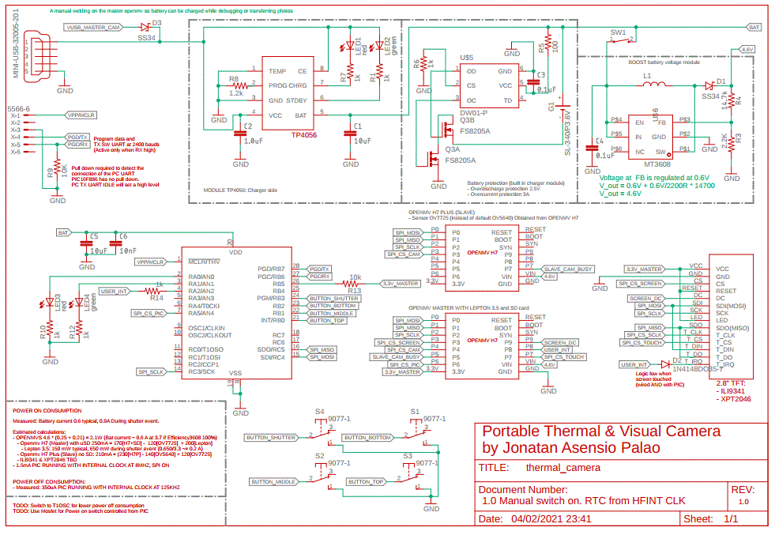
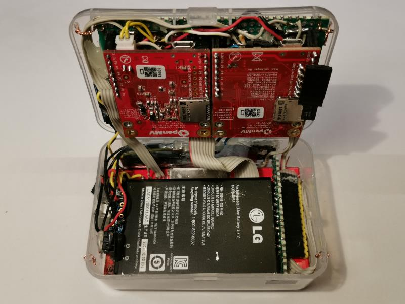
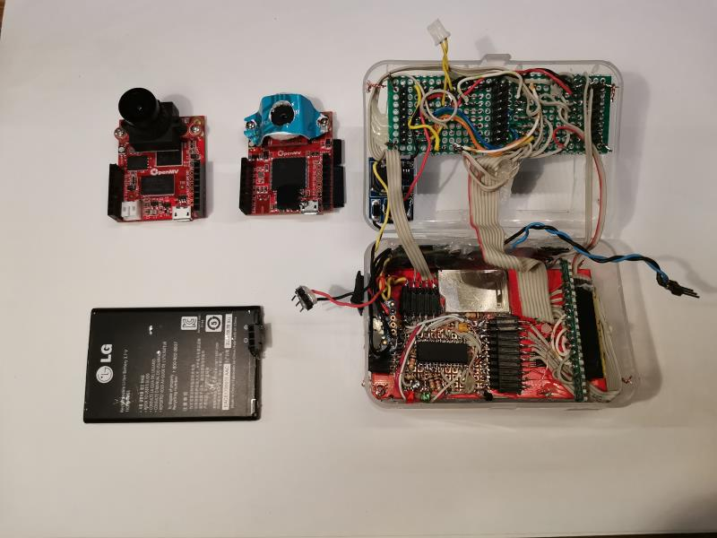

# Thermal Camera & Visual Image Fusion by [Jonatan Asensio Palao](https://es.linkedin.com/in/jonatan-asensio-palao-369a4143)

### Table of Contents  

[Introduction](#introduction)  
[Electronic design](#electronic_design)  
[Results](#results)  

<a name="introduction"/>

## Introduction

This project details the software and hardware to build a portable thermal camera with visual image fusion.

- Openmv H7 Thermal image as master SPI node
- Openmv H7 Plus Visual image as slave SPI node
- PIC 16F886 as auxiliar processor (RTC, buttons, battery measurement)
- 2.8" Touch screen with ILI9341 and XPT2046 with 

<a name="electronic_design"/>

## Electronic design

See: [Design decisions involved in version 1](doc/architecture_design_record_001.md)

[More info for version 1]: doc/architecture_design_record_001.md	"Design decisions involved in version 1"

<a name="results"/>

## Hardware mounting

Mounting of Lepton 3.5 See: [Design decisions involved in version 1](doc/lepton_mounting.md)

## Results

