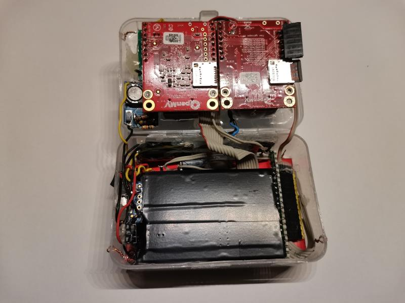

# Thermal Camera & Visual Image Fusion by [Jonatan Asensio Palao](https://es.linkedin.com/in/jonatan-asensio-palao-369a4143)

Github: https://github.com/jasensiopalao/thermal_camera

### Table of Contents  

[Introduction](#introduction)  
[Electronic design](#electronic_design)  
[Results](#results)  
[Hardware mounting](#hardware_mounting)  
[References](#references)  

#### Design records:
* [Initial](doc/design_record_001_initial.md)
* [Improvement of RTC](doc/design_record_002_rtc_improvement.md)

<a name="introduction"/>

## Introduction

This project details the software and hardware to build a portable thermal camera with visual image fusion.

- Openmv H7 with Lepton 3.5 Thermal Camera (SPI master)
- Secondary Openmv H7 Plus as Visual image (SPI slave)
- PIC 16F886 as auxiliar processor (RTC, buttons, battery measurement)
- 2.8" Touch screen (ILI9341 and XPT2046)

<a name="electronic_design"/>

## Electronic design

See: [Design decisions involved in version 1](doc/design_record_001_initial.md)

### Design records:
* [Initial](doc/design_record_001_initial.md)
* [Improvement of RTC](doc/design_record_002_rtc_improvement.md)

<a name="hardware_mounting"/>

## Hardware mounting

For Lepton 3.5 mounting, see: [Mounting Lepton](doc/lepton_mounting.md)

<a name="results"/>

## Results

<a name="references"/>

## References

Openmv links:
* General info: https://openmv.io/
* Framework repo: https://github.com/openmv/openmv
* Micropython repo: https://github.com/micropython/micropython

Several datasheets or manufacturer documents have been cached in this project so future readers have the copy of the document that was used during the design of this project:

[Reference values for ILI9341 in Application notes](doc/external/ILI9341.pdf)
[Datasheet PIC16F866 (including AC/DC characteristics) ](doc/external/ILI9341.pdf)
[Lepton 3.5 Engineering datasheet](doc/external/Lepton_3_5_Eng.pdf)
[Lepton 3.5 API](doc/external/Lepton_3_5_API.pdf)

Reference repos while I was getting started with the touch display:
 * To display on ILI9341: https://github.com/OutOfTheBots/OpenMV_TFT
 * To read touch from XPT2046: https://github.com/Luca8991/XPT2046-Python

_____

Tags: camara termica, lepton, openmv h7, pic16f886, boostc, eagle, crystal 32k, rtc, ili 9341, xpt 2046, mt3608, tp4056