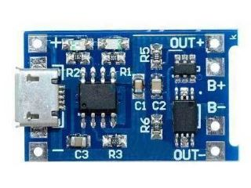
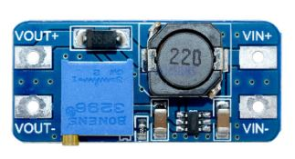
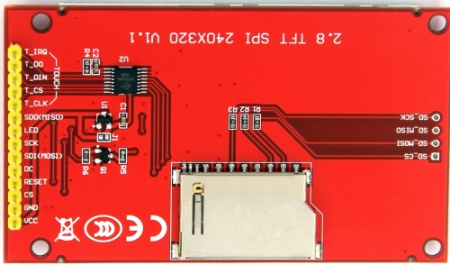

[Back to Main](../README.md)

<a name="Software frameworks"/>

# Software tooling

Compilation from PIC: [BoostC (free compiler with active development)](http://www.sourceboost.com/Products/BoostC/Overview.html)

Schematic design: Autocad Eagle. Free license available

<a name="hardware"/>

# Hardware

The following devices share SCLK, MISO and MOSI:

- Openmv H7 with Lepton 3.5. SPI Master. Lepton 3.5 was used since it has shutter to calibrate the sensor. The shutter is important for radiometric measurements (absolute temperature readings)
- Openmv H7 Plus with the sensor from the H7. There fore OV7725 was used as visual camera (The sensor that comes with first version of H7). Reasoning:
  - OV7725 (original in H7) Pros: has bigger pixle size than OV5640, so OV7725 is more sensitive in dark conditions
  - OV5640  (original in H7 Plus) Cons: openmv driver wasn't as fast as the one for OV7725 at the time of building the project
- AuxilarProcessor:
  - PIC 16F886 was chosen over an Arduino solution mostly because I am more familiar with PIC.
  - Functions:
    - Buttons debouncing
    - Battery voltage averaging
    - Indication LED for Input read From Master Openmv
    - Real Time Clock, to keep time even when the Openmv master is Off.
- ILI9341 TFT screen. 2.8". Great size for the camera. The original TFT for Openmv is too small.
- XPT2046 Touch screen. It comes with the screen and it will be used mostly to inspect the temperature in a region of the screen.

Additional Pinout

- Shared pin from AuxilarProcessor and XPT2046 to indicate to the Master that input data is ready
- command/data pin for ILI9341
- Slave Openmv busy pin, to indicate to the Master that the visual image isn't ready

Power supply was implemented with 2 modules which provide the following set of features:

* Charge profile for lithium batteries (Figure module 4056)
* Over-current/Over-discharge protections (Figure module 4056)
* Boost and Stabilize the Battery Voltage (Figure module 3608):
  * The Minimum Input voltage for the Openmv is 3.6 V
  * The battery can have dips of Voltage as low as 3.0 when considerable current is withdrawn
  * ILI9341 Needs to be fed from the master Openmv to achieve the best SPI speeds (Best voltage alignment). However this requires to be even more strict on the mininum voltage of 3.6
  * ILI9341Backlight was stable (even during Lepton shutter active) once the Openmv was fed with 4.0V or greater. Therefore the module 3608 was configured to work at 4.6 V (less would have been ok too, but I preferred to choose a higher voltage in case I wanted to control other peripherals) 
  * The variable resistor of the module was replaced by fixed resistors to prevent variations over time

