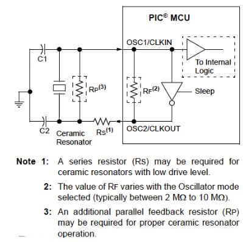
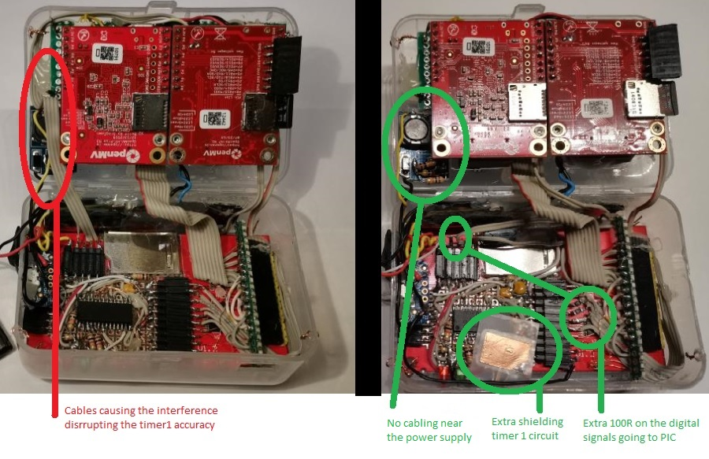
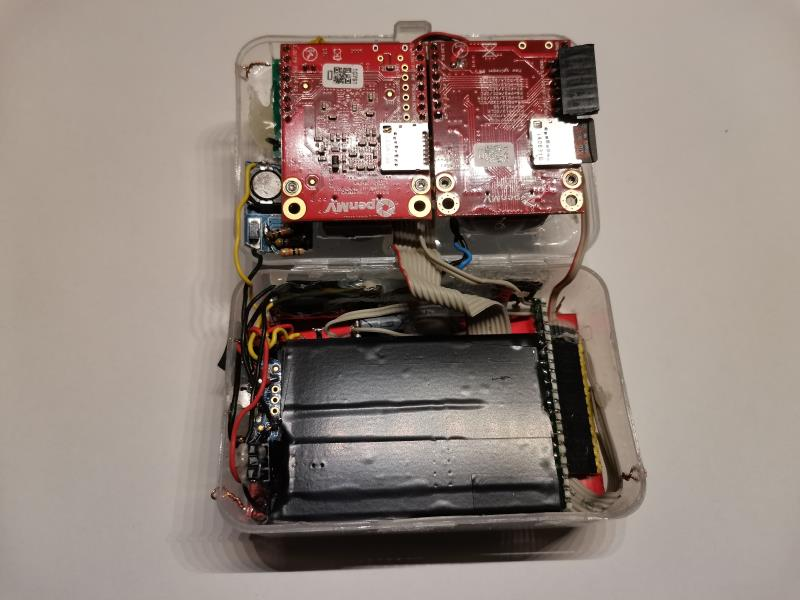
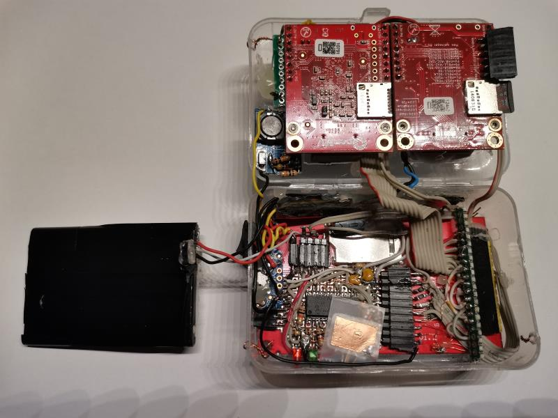
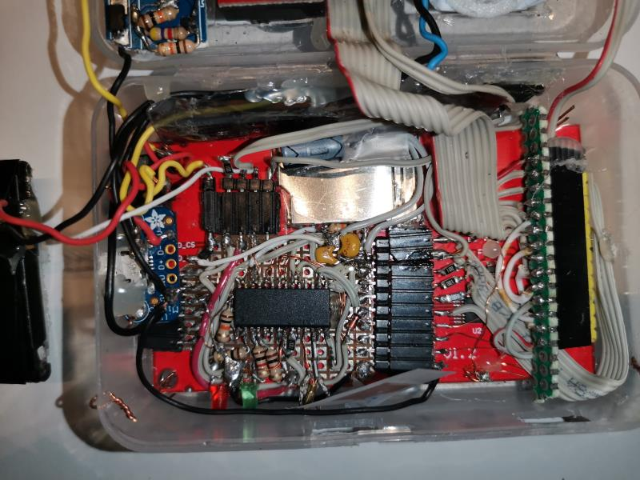

[Back to Main](../README.md)

### Table of Contents  

- [Introduction](#introduction)  
- [Changes to use a 32kHz crystal](#changes_32k_crystal)  
- [Troubleshooting](#troubleshooting)
- [Further power consumption optimizations](#further_power_consumption_optimizations)
- [Assembly](#assembly)
- [References](#references)

further_low_power_consumption_optimizations

<a name="introduction"/>

# Introduction of the changes

The Real Time Clock implementation in the design has been upgraded by using a 32.768 Hz crystal, tacking the following aspects:
* Accuracy improved to 20ppm (wrost case 1.728 seconds/day ). While the internal osc. of the PIC (HFINT) was fairly accurate (especially since the calibration factor was implemented in the main openmv), there was still a drift that could not be calibrated as it depended on temperature or voltage state of the battery (PIC is powered directly from the battery without power supply).
* PIC Power consumption was reduced from ~350uA to 4uA. Running with the HFINT at 125kHz still consumed quite a bit for a standby mode (this was ~150uA, and the SPI SS pull up described in sections below was accountable for ~200uA). We want the camera to keep time even if it is not used for a year.

<a name="changes_32k_crystal"/>

# Changes to use a 32kHz crystal

The PIC16F886 has all the circuitry required for driving an external crystal 32.768 Hz in Timer1. However depending on other properties of the crystal (e.g. load capacitance) we will also require certain other discrete components.

From what I have learnt in this process I got the following conclusions:
  * C1, C2 and Rs seem to be crucial to get the power consumption and the accuracy right. They don't need to have an exact value, but completely ignoring them can lead to quite some frustration.
  * Higher C1 and C2 values will provide higher stability at the cost of more consumption. C1xC2/(C1+C2) + C_strays ~= C_crystal_load (C_strays seems to be any other parasitic capacitances)
  * Rs will help to not over-drive the crystal. A consequence of the crystal being overdriven can actually be that you see it counting slower! However Rs value will depend very much on the Device that it is being used. Sadly I couldn't find in the datasheet of the PIC16F886 nor in the datasheet of the crystal any indication about parameters related to this value. Furthermore, the [AN849](../doc/external/32k_osc/Microchip_AN849.pdf) Guide from Microchip states that this value should not exceed 100k, and contradictorily, in [TP097](../doc/external/32k_osc/Microchip_TP097.pdf) Guide from Microchip it used a 220k.
 
Finally I chose the following (limited also by what I had in stock):
  * [MS3V-T1R 7pF](../doc/external/32k_osc/Crystal_MS3V-T1R.pdf)
  * Capacitors: C1 and C2 as 16pF caps (each one was actually two of 33pF in series). C1xC2/(C1+C2) would be 8.5pF which is close to the 7pF. Here I didn't consider the C_strays, as in the datasheet I couldn't get a final conclusion. On the one hand it indicates 50pF, on the other it says that the osc design for timer1 osc is the same as for the main LP osc.
  * Rs: 240k (two SMD 120k). As [TP097](../doc/external/32k_osc/Microchip_TP097.pdf) guide used a similar crystal to the one I bought, I chose to go with a value close to 220k.

Finally, this complete implementation turned out very well as the PIC consumption while timer 1 is counting and the PIC is sleeping it rounds up to ~3.5 uA.

<a name="troubleshooting"/>

# Troubleshooting

During the development I realized that time would get delayed only while the Camera was ON. While powered OFF, it was very accurate.
* Possible root causes: Interferneces from: either power supply or from SPI bus.
* Final finding: There were some digial IO that was passing near the coil from the switching power supply.
* Solutions and corrective actions:
   * Any digial IO re-routed as far as possible from the MT3608
   * Added 100k at PIC IO. With IO pin 50 pF 100R will make a low-pass filter around 32MHz (The SPI at PIC will communicate at 25MHz)
   * Improved power supply to the PIC. A peak-follower-like circuit will:
        - stabilize the battery Voltage that we measure
        - Stabilize the VDD which is important for a 32k Timer1 accuracy
        - Provide as a temporary power source if battery is removed or over discharge protection circuit trigger

<a name="further_low_power_consumption_optimizations"/>

# Further power consumption optimizations

In the previous design the PIC already included a pull up resistor of 10k at the SS pin for the SPI. This was introduced to prevent that the SPI module in the PIC would think it was "selected" at the time that the OPENMV was switched Off from power. The absence of the pull up had resulted in 20mA current from SDO to OPENMV pin (probably casused by the internal diods that pins have to protect that IO)

So while this Pull up was working well to prevent 20mA, I concluded it was accountable for 200uA. The solution was to feed it from another pin of the PIC. This makes the power OFF flow as follows:

  1. OPENMV is running, PIC is in normal operation
  1. OPENMV power is cut-off
  1. PIC is waiting for 10s to see if OPENMV is powered back ON. Pull kept to VDD. During this time SPI module is active, but idling, thanks to the pull up.
  1. PIC goes into low power consumption: Switches off the SPI module (set SDO also as input) and pull up is deactivated (Brought to VSS)

Finally, one more adjustment has been to lower the output of the MT3608 from 4.6V to 4.2V.

<a name="assembly"/>

# Assembly

<a name="references"/>

# References

* [32kHz Crystal datasheet](../doc/external/32k_osc/Crystal_MS3V-T1R.pdf)
* [Microchip guide TP097](../doc/external/32k_osc/Microchip_TP097.pdf)
* [Microchip guide AN849](../doc/external/32k_osc/Microchip_AN849.pdf)

