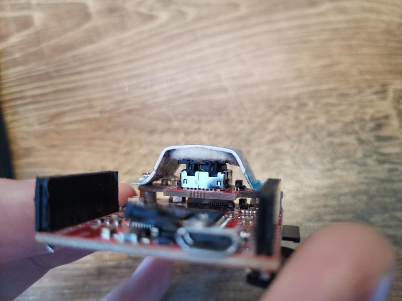
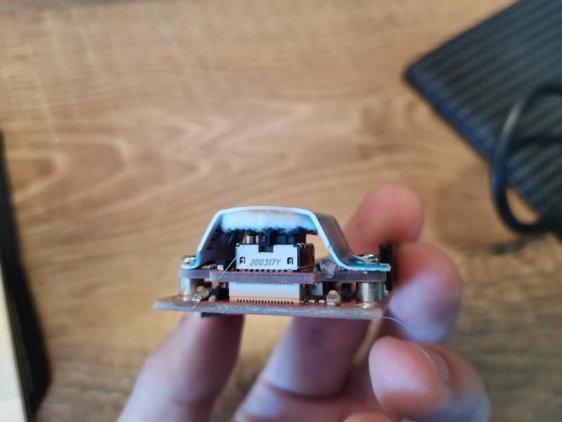
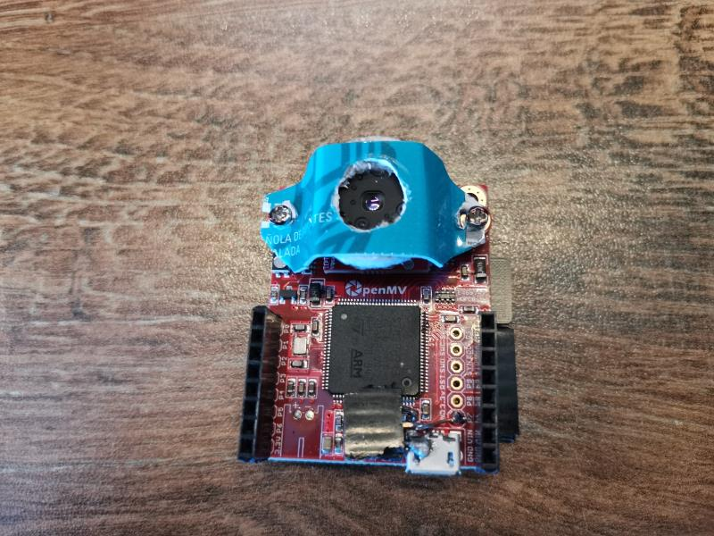

[Back to Main](../README.md)

Github: https://github.com/jasensiopalao/thermal_camera

# Mounting

When I insterted the [Lepton 3.5](../doc/external/Lepton_3_5_Eng.pdf) into its socket I was quite disappointed by how lose the module would remain. It was very difficult to find on internet a clear picture on how deep the module inserts in the socket. My efforts to just try to push the Lepton as dip as possible (without exceeding the 1kgF stated by the [Engineering datasheet](../doc/external/Lepton_3_5_Eng.pdf)) did not result in any better connection. In fact, too much wigling of the module on the socket just resulted in a malfunctioning socket, so I had to buy a second one.

I concluded that the only way I could get a stable mounting was to attach a structure that would get srewed on the OPENMV camera socket mounting.

In the pictures below you can see the final mounting:

# References

* [Lepton 3.5 Engineering Datasheet](../doc/external/Lepton_3_5_Eng.pdf)
